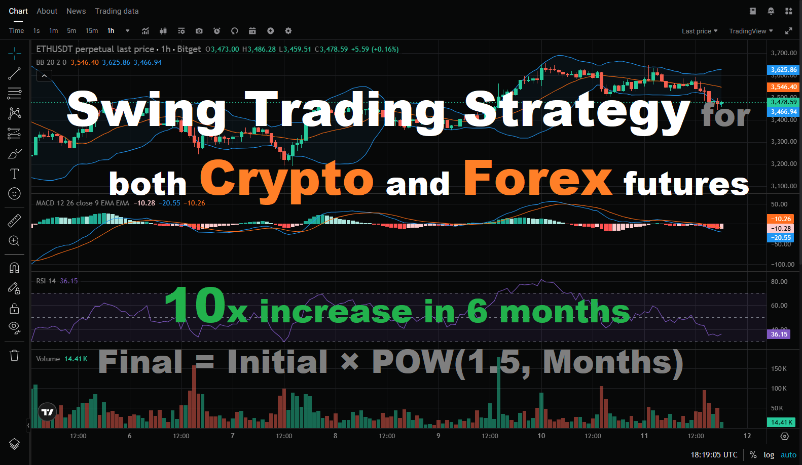
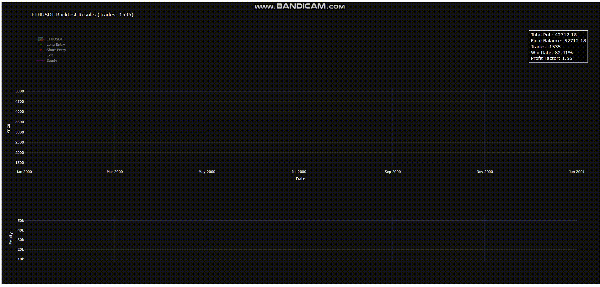

# 🚀 Botara 3.0 - Advanced Futures Trading Bot



A sophisticated algorithmic trading system designed for cryptocurrency and forex futures markets. This bot implements a multi-indicator strategy with advanced risk management, position tracking, and real-time monitoring capabilities.


## 📋 Table of Contents

- [Overview](#overview)
- [Strategy Description](#strategy-description)
- [Key Features](#key-features)
- [Backtesting Results](#backtesting-results)
- [Live Testing](#live-testing)
- [Installation](#installation)
- [Configuration](#configuration)
- [Usage](#usage)
- [Risk Management](#risk-management)
- [Performance Metrics](#performance-metrics)
- [Contact & Support](#contact--support)

## 🎯 Overview

**Botara 3.0** is the result of extensive research and development in algorithmic trading. It combines multiple technical indicators with sophisticated risk management to execute trades automatically on futures markets. The strategy has been thoroughly backtested using **Bitget** and **Blofin** candle data across multiple cryptocurrency and forex pairs, showing consistent profitability.

**Supported Exchanges:**
- **Cryptocurrency:** Binance, Bitget, Blofin, Bybit, and more
- **Forex:** MetaTrader4/5 platforms
- **Stock** TradeStation and more

**Current Status:** Successfully live testing for 2+ months with positive results. Ongoing live testing continues.

## 📊 Strategy Description

The bot employs a **multi-indicator crossover strategy** that combines:

### Core Indicators

1. **Fisher Transform (FS)** - Identifies potential trend reversals and momentum shifts </br>
https://www.tradingview.com/support/solutions/43000589141/
2. **RSI (Relative Strength Index)** - Filters entries based on overbought/oversold conditions </br>
https://www.tradingview.com/support/solutions/43000502338/
3. **Volume Oscillator** - Ensures trades are taken during periods of volume confirmation </br>
https://www.tradingview.com/support/solutions/43000591350/
4. **ATR (Average True Range)** - Dynamically adjusts stop-loss and take-profit levels based on market volatility </br>
https://www.tradingview.com/support/solutions/43000501823/

### Entry Logic

**Long Positions:**
- FS crosses above TR (bullish crossover)
- RSI deviates significantly from 50 (momentum confirmation)
- FS/TR magnitude exceeds threshold (strong signal strength)
- Volume oscillator is positive (volume confirmation)

**Short Positions:**
- FS crosses below TR (bearish crossover)
- RSI is near neutral (contrarian entry)
- FS/TR magnitude exceeds threshold
- Volume oscillator is positive

### Exit Logic

- **Take Profit:** ATR-based dynamic take-profit levels
- **Stop Loss:** ATR-based dynamic stop-loss with trailing stop functionality
- **Half Exit:** Automatic 50% position closure at first take-profit target
- **Trailing Stop:** Activates after half exit to protect remaining position

### Parameter Optimization with Optuna

The Entry/Exit Levels have been meticulously optimized using **Optuna**, a state-of-the-art hyperparameter optimization framework. The optimization process utilized several years of historical market data to ensure robust and reliable parameter sets.

#### Why Optuna?

**Optuna** provides significant advantages over traditional optimization methods:

1. **Tree-structured Parzen Estimator (TPE)** - Advanced Bayesian optimization that efficiently explores the parameter space
2. **Pruning Mechanism** - Automatically stops unpromising trials early, saving computational resources
3. **Parallel Optimization** - Supports distributed optimization across multiple cores/machines
4. **Visualization Tools** - Built-in tools for analyzing optimization history and parameter importance
5. **Flexible Search Spaces** - Supports complex parameter distributions (uniform, log-uniform, categorical, etc.)
6. **Efficient Sampling** - Intelligently samples parameter combinations based on previous trial results

#### Optimization Process

- **Historical Data:** Several years of market data from multiple exchanges
- **Objective Function:** Maximized Sharpe ratio, profit factor, and minimized drawdown
- **Validation:** Walk-forward analysis to prevent overfitting
- **Result:** Optimized parameters that balance profitability with risk management

This data-driven approach ensures that the Entry/Exit Levels are not arbitrary but are statistically validated against extensive historical market conditions.

## ✨ Key Features

### 🎯 Trading Features
- **Automated Signal Detection** - Monitors market conditions every hour
- **Dual Position Support** - Can hold both long and short positions simultaneously
- **Dynamic Risk Management** - ATR-based stop-loss and take-profit calculations
- **Trailing Stop Loss** - Automatically adjusts stop-loss to lock in profits
- **Partial Position Exits** - Takes profit on 50% of position while letting winners run
- **Position Replacement** - Automatically replaces losing positions with better entry points

### 📈 Monitoring & Analytics
- **Real-time Position Monitoring** - Checks positions every second
- **Trade History Tracking** - Complete CSV-based trade log
- **Performance Metrics** - Win rate, drawdown, daily PnL tracking
- **Webhook Integration** - Real-time notifications for trades and statistics
- **Daily PnL Reports** - Automated performance summaries

### 🔧 Technical Features
- **Thread-safe Operations** - Multi-threaded architecture for concurrent operations
- **State Persistence** - Resumes from CSV on restart
- **Error Handling** - Robust error handling and recovery
- **Command Interface** - Interactive CLI for manual control
- **Multi-Exchange Support** - Compatible with Binance, Bitget, Blofin, Bybit APIs
- **Forex Platform Support** - Available for MT4 and MT5 platforms
- **Optuna-Optimized Parameters** - Entry/Exit levels optimized using advanced hyperparameter optimization

## 📈 Backtesting Results

The strategy has been extensively backtested using **Bitget** and **Blofin** candle data across multiple markets:



### Cryptocurrency Pairs
- ✅ **ETH/USDT** - Strong performance
- ✅ **SOL/USDT** - Excellent results
- ✅ **LINK/USDT** - Profitable
- ✅ **UNI/USDT** - Consistent gains
- ✅ **DOGE/USDT** - Good performance
- ✅ **SUSHI/USDT** - Positive returns
- ✅ **TAO/USDT** - Strong results
- ✅ **ZEC/USDT** - Profitable

### Forex Pairs
- ✅ **EUR/USD** - Consistent performance
- ✅ **GBP/USD** - Strong results

### Stock Pairs
- Working now

> 📊 Detailed backtesting results with charts and trade logs are available in the `crypto_symbols/` and `forex_symbols/` directories.

## 🚀 Live Testing

**Current Status:** ✅ Live testing in progress

- **Duration:** 2+ months of successful live trading
- **Performance:** Positive results with consistent profitability
- **Ongoing:** Continuous live testing and optimization

The bot is currently running live trades and demonstrating strong performance in real market conditions.

## 🛠️ Installation

### Prerequisites

- Python 3.8 or higher
- pip package manager

### Step 1: Clone the Repository

```bash
git clone https://github.com/simoncampos1022/botara_profitable_futures_trading_strategy_crypto_forex_stock.git
cd botara_strategy
```

### Step 2: Install Dependencies

```bash
pip install -r requirements.txt
```

If `requirements.txt` doesn't exist, install manually:

```bash
pip install requests pandas numpy
```
## ⚙️ Configuration

### Trading Parameters

| Parameter | Description | Default |
|-----------|-------------|---------|
| `INITIAL_BALANCE` | Starting capital | 10000 |
| `LEVERAGE` | Trading leverage | 5x |
| `POSITION_SIZE_RATIO` | Position size as % of balance | 0.4 (40%) |
| `INTERVAL` | Candle timeframe | 1H |
| `FEE_PERCENT` | Trading fee percentage | 0.0006 (0.06%) |

### Indicator Settings

| Indicator | Length | Description |
|-----------|--------|-------------|
| `ATR_LENGTH` | 14 | Average True Range period |
| `FS_LENGTH` | 10 | Fisher Transform period |
| `RSI_LENGTH` | 14 | RSI calculation period |

### Entry/Exit Levels

> ⚙️ **Note:** These parameters have been optimized using **Optuna** framework with several years of historical data. The optimization process utilized advanced Bayesian optimization techniques to find optimal parameter combinations that maximize profitability while minimizing risk.

**Long Positions:**
- FS Entry Level: ? *(Optuna-optimized)*
- RSI Entry Level: ? *(Optuna-optimized)*
- Stop Loss: ? × ATR *(Optuna-optimized)*
- Take Profit: ? × ATR *(Optuna-optimized)*
- Trailing Stop: ? × ATR *(Optuna-optimized)*

**Short Positions:**
- FS Entry Level: ? *(Optuna-optimized)*
- RSI Entry Level: ? *(Optuna-optimized)*
- Stop Loss: ? × ATR *(Optuna-optimized)*
- Take Profit: ? × ATR *(Optuna-optimized)*
- Trailing Stop: ? × ATR *(Optuna-optimized)*

## 🎮 Usage

### Starting the Bot

```bash
python botara3_bot.py
```

### Interactive Commands

Once running, you can use these commands:

```
help                    - Show available commands
force open long         - Manually open a long position
force open short        - Manually open a short position
force close long        - Manually close long position
force close short       - Manually close short position
force half close long    - Close 50% of long position
force half close short  - Close 50% of short position
balance                 - Show current balance
price                   - Show current price
exit                    - Shutdown the bot
```

### Strategy Loop

The bot automatically:
1. Updates indicators every hour (at :00:05 UTC)
2. Checks for entry/exit signals
3. Monitors positions every second
4. Updates trailing stops in real-time
5. Saves all trades to CSV

## 🛡️ Risk Management

### Position Sizing
- Uses 40% of available balance per position
- Leverage: 5x (configurable)
- Maximum 1 long and 1 short position simultaneously

### Stop Loss Protection
- Dynamic ATR-based stop-loss levels
- Trailing stop activates after take-profit hit
- Real-time monitoring every second

### Take Profit Strategy
- First target: Close 50% of position
- Remaining 50%: Protected by trailing stop
- Maximizes profit while securing gains

### Risk Controls
- Position replacement logic (replaces losing positions)
- Volume confirmation required for entries
- Multiple indicator confirmation before entry

## 📊 Performance Metrics

The bot tracks comprehensive performance metrics:

- **Total PnL** - Overall profit/loss percentage
- **Win Rate** - Percentage of profitable trades
- **Max Drawdown** - Maximum peak-to-trough decline
- **Daily PnL** - Daily profit/loss tracking
- **Total Trades** - Number of completed trades
- **Last Trade PnL** - Most recent trade performance

All metrics are automatically sent via webhook after each closed trade.

## 📁 Project Structure

```
botara_strategy/
├── blofin_eth_bot.py          # Main trading bot
├── eth_blofin_history.csv     # Trade history (auto-generated)
├── crypto_symbols/             # Crypto backtesting results
│   ├── case_ETHUSDT_chart.html
│   ├── case_ETHUSDT_trades.csv
│   └── ...
├── forex_symbols/              # Forex backtesting results
│   ├── case_EURUSD_chart.html
│   ├── case_EURUSD_trades.csv
│   └── ...
├── logo.png                    # Project logo
├── html_guide.gif              # Visualization guide
└── README.md                   # This file
```

## 🔗 Contact & Support

### Need Help?

As a **senior software engineer** and **trading expert** with extensive experience in:
- Algorithmic trading automation
- Backtesting strategies
- Strategy optimization
- Python development

I'm available to help with:

- 🚀 **Trading Automation** - Custom bot development
- 📊 **Backtesting** - Strategy validation and testing
- ⚙️ **Optimization** - Parameter tuning and strategy refinement
- 💻 **Development** - Python trading system development

### Get in Touch

- **Telegram:** [@simoncampos1022](https://t.me/simoncampos1022)
- **Email:** simon.campos1022@gmail.com

Feel free to reach out for collaboration, consulting, or any questions about algorithmic trading!

**Happy Trading!**

